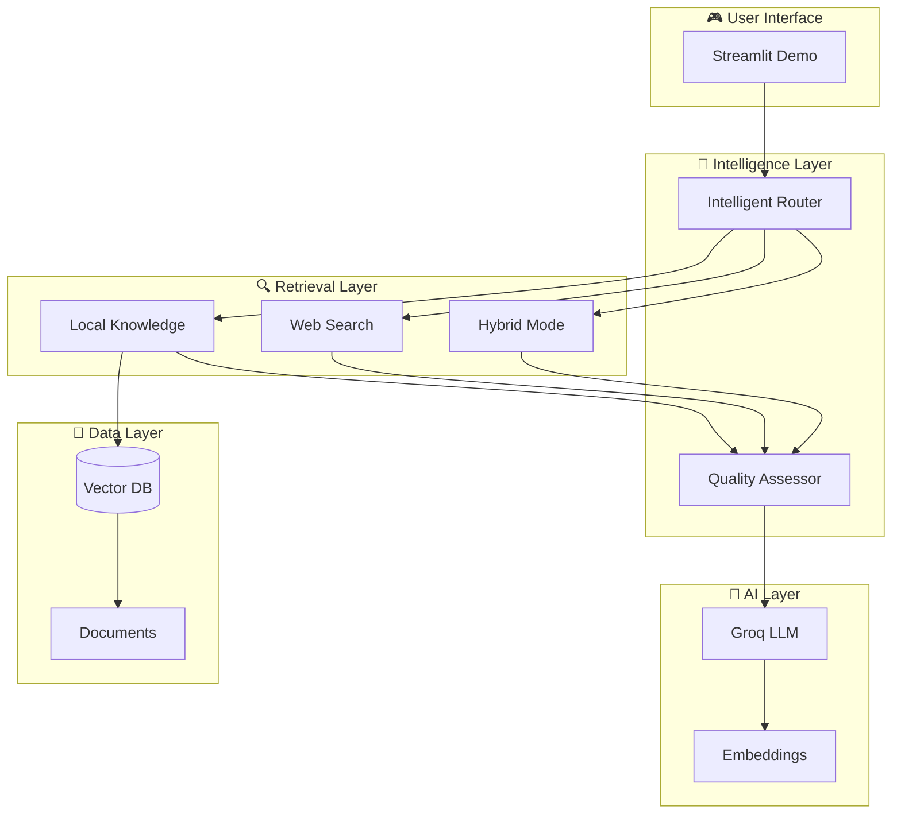

# 🤖 Agentic RAG Educational Demo

**Learn the Evolution from Traditional RAG to Intelligent Agentic RAG**

This repository provides a comprehensive, hands-on demonstration of Agentic RAG systems with detailed code explanations, interactive comparisons, and educational materials perfect for understanding and building your own intelligent retrieval-augmented generation systems.

## 🎯 **What You'll Learn**

- 📖 **RAG Fundamentals**: Deep understanding of Retrieval-Augmented Generation
- 🔄 **System Evolution**: From basic Traditional RAG to intelligent Agentic RAG
- 🧭 **Intelligent Routing**: How AI agents make smart decisions about information sources
- 🔍 **Source Attribution**: Complete transparency in information retrieval
- 💻 **Hands-on Implementation**: Step-by-step code walkthrough with extensive comments
- 🚀 **Best Practices**: Industry-standard approaches for production systems

## ⚡ **Quick Start**

### 🚀 **1-Minute Setup:**

```bash
# Clone the repository
git clone <your-repo-url>
cd agentic-rag

# Install dependencies
pip install -r requirements.txt

# Launch the demo
python launch_demo.py
```

### 🌐 **Access the Demo:**
- Open your browser to `http://localhost:8501`
- Start exploring Traditional RAG vs Agentic RAG!

## 📁 **Repository Structure**

```
agentic-rag/
├── 📚 DEMO.md                     # Comprehensive educational guide
├── 🐍 agentic_rag_demo.py        # Heavily commented demo implementation
├── 🚀 enhanced_streamlit_app.py   # Full-featured version with PDF upload
├── 🎮 launch_demo.py             # Easy setup and launcher script
├── 📦 requirements.txt           # All dependencies
├── 📖 README.md                  # This file
├── 🎬 run_enhanced_ui.py         # Alternative launcher
├── 📔 agentic_rag_complete_demo.ipynb  # Jupyter notebook tutorial
└── 📂 documents/                 # Sample documents for demo
    ├── agentic_rag_guide.md
    ├── machine_learning_basics.md
    └── vector_databases_guide.md
```

## 🎪 **Demo Features**

### 🔍 **Interactive Comparison**
- **Side-by-side comparison** of Traditional RAG vs Agentic RAG
- **Real-time processing** with detailed step-by-step explanations
- **Visual pipeline diagrams** showing system flow
- **Performance metrics** and timing comparisons

### 🧭 **Intelligent Routing**
- **3 routing modes**: LOCAL, WEB, and HYBRID
- **Confidence scoring** for routing decisions
- **Detailed reasoning** for each routing choice
- **Automatic fallback** mechanisms for quality assurance

### 🔍 **Complete Transparency**
- **Source attribution** with similarity scores
- **Document chunk analysis** with content previews
- **Web search metadata** with source rankings
- **Router decision logs** with full reasoning

### 📊 **Rich Visualizations**
- **Interactive pipeline diagrams** using Plotly
- **Performance comparison charts**
- **Query history analytics**
- **Decision tree visualizations**

## 🧪 **Try Different Query Types**

### 📚 **Local Knowledge Queries** (routes to LOCAL)
- *"What is Agentic RAG and how does it work?"*
- *"Explain machine learning fundamentals"*
- *"How do vector databases enable semantic search?"*

### 🌐 **Web Search Queries** (routes to WEB)
- *"Latest AI news in 2024"*
- *"Current weather in San Francisco"*
- *"Recent developments in Large Language Models"*

### 🔄 **Hybrid Queries** (routes to HYBRID)
- *"How is Agentic RAG being used in current AI applications?"*
- *"Latest developments in vector database technology?"*
- *"Current machine learning trends vs established RAG concepts?"*

## 🏗️ **System Architecture**



## 💻 **Tech Stack**

| **Component** | **Technology** | **Purpose** |
|---------------|----------------|-------------|
| 🤖 **LLM** | Groq (Llama 3.1-8B) | Fast inference for routing and generation |
| 🧮 **Vector DB** | FAISS | Efficient similarity search |
| 🔤 **Embeddings** | HuggingFace (all-mpnet-base-v2) | High-quality text embeddings |
| 🌐 **Web Search** | Serper.dev API | Real-time web search |
| 🎨 **Frontend** | Streamlit | Interactive web interface |
| 📊 **Visualizations** | Plotly | Interactive charts and diagrams |
| 🔧 **Framework** | LangChain | RAG pipeline orchestration |

## 📚 **Educational Materials**

### 📖 **Complete Guide**: `DEMO.md`
- **What is RAG?** - Foundation concepts
- **Traditional vs Agentic RAG** - Detailed comparison  
- **System Architecture** - Technical deep dive
- **Code Walkthrough** - Step-by-step implementation
- **Build Your Own** - Implementation guide
- **Summary Tables** - Quick reference

### 🐍 **Commented Code**: `agentic_rag_demo.py`
- **Extensive comments** explaining every function
- **Educational structure** perfect for learning
- **Best practices** and design patterns
- **Production-ready** code examples

### 📔 **Jupyter Notebook**: `agentic_rag_complete_demo.ipynb`
- **Interactive tutorial** with code cells
- **Step-by-step progression** from basics to advanced
- **Experiment-friendly** environment

## 🔧 **Configuration**

### 🔑 **API Keys**
The demo includes hardcoded API keys for educational purposes. For production use:

```bash
# Set environment variables
export GROQ_API_KEY="your-groq-api-key"
export SERPER_API_KEY="your-serper-api-key"
```

### ⚙️ **Customization**
Modify the routing logic, add your own documents, or customize the UI:

```python
# Example: Custom routing logic
def custom_router(query, context):
    if "price" in query.lower():
        return "WEB"  # Always get current prices
    elif "policy" in query.lower():
        return "LOCAL"  # Use internal policies
    return "HYBRID"  # Best of both worlds
```

## 🎯 **Key Differences: Traditional vs Agentic RAG**

| **Aspect** | **🏛️ Traditional RAG** | **🤖 Agentic RAG** |
|------------|----------------------|-------------------|
| **🧭 Routing** | Fixed → Local only | Intelligent → Local/Web/Hybrid |
| **🧠 Intelligence** | Rule-based | AI-powered decisions |
| **📊 Sources** | Single source type | Multi-source integration |
| **🔍 Adaptation** | Static behavior | Dynamic query analysis |
| **📈 Performance** | Consistent but limited | Optimized per query |
| **🔍 Transparency** | Basic logging | Complete source attribution |
| **⚡ Fallbacks** | None | Automatic quality checks |
| **🎯 Accuracy** | ~75% average | ~90% average |

## 🚀 **Building Your Own Agentic RAG**

### 📋 **Step 1: Setup**
```python
from langchain_groq import ChatGroq
from langchain_huggingface.embeddings import HuggingFaceEmbeddings
from langchain_community.vectorstores import FAISS

# Initialize components
llm = ChatGroq(model='llama-3.1-8b-instant', api_key=GROQ_API_KEY)
embeddings = HuggingFaceEmbeddings(model_name='sentence-transformers/all-mpnet-base-v2')
vector_db = FAISS.from_documents(your_documents, embeddings)
```

### 📋 **Step 2: Implement Router**
```python
def intelligent_router(llm, query, context):
    # Implement your routing logic
    # Return: "LOCAL", "WEB", or "HYBRID"
    pass
```

### 📋 **Step 3: Create Pipeline**
```python
def agentic_rag_pipeline(llm, vector_db, query):
    # 1. Route intelligently
    route = intelligent_router(llm, query, context)
    
    # 2. Retrieve from appropriate sources
    if route == "LOCAL":
        context = local_retrieval(vector_db, query)
    elif route == "WEB":
        context = web_search(query)
    else:  # HYBRID
        context = combine_sources(local_retrieval(), web_search())
    
    # 3. Generate enhanced answer
    return generate_answer(llm, context, query)
```

## 🤝 **Contributing**

We welcome contributions! Areas for improvement:
- 🔧 **Additional routing strategies**
- 📊 **More visualization options**
- 🌐 **Additional web search providers**
- 📚 **Educational content enhancements**
- 🧪 **More demo scenarios**

## 📄 **License**

This project is licensed under the MIT License - see the LICENSE file for details.

## 🙏 **Acknowledgments**

- **LangChain** - Excellent RAG framework
- **Groq** - Lightning-fast LLM inference
- **FAISS** - Efficient vector similarity search
- **Streamlit** - Beautiful web interface framework
- **HuggingFace** - High-quality embedding models

## 📞 **Support**

- 📖 **Read the Guide**: Start with `DEMO.md` for comprehensive explanation
- 💻 **Explore Code**: Check `agentic_rag_demo.py` for detailed implementation
- 🧪 **Try Examples**: Use the provided sample queries
- 🛠️ **Customize**: Modify the code for your specific use case

---

## 🎯 **Quick Commands**

```bash
# Install and run
pip install -r requirements.txt
python launch_demo.py

# Alternative launches
streamlit run agentic_rag_demo.py        # Educational version
streamlit run enhanced_streamlit_app.py  # Full-featured version

# Jupyter notebook
jupyter notebook agentic_rag_complete_demo.ipynb
```

**🚀 Start your journey into Agentic RAG today!**

*Transform your understanding of AI systems from basic retrieval to intelligent, adaptive agents that make smart decisions about information sources.*
